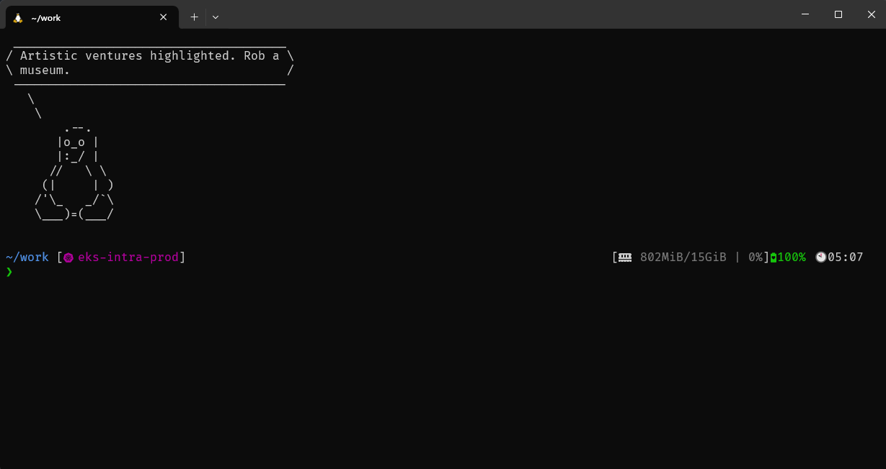
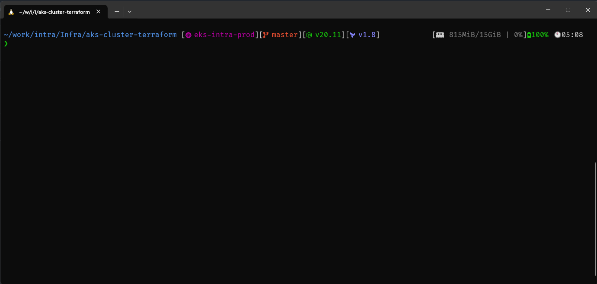

# Terminal Setup ( Ubuntu )



## Apparatus
- shell - Fish - https://fishshell.com/
  - config_file - config.fish 
- fonts - Nerd Fonts - [git@github.com:ryanoasis/nerd-fonts.git](https://github.com/ryanoasis/nerd-fonts)
- prompt - Starship - https://starship.rs/
  - config_file - starship.toml

 ## Reciepe

 1. Install initial dependencies
 ```
 sudo apt-get install -y cowsay fortune fortunes-min
 ```
 2. Install & setup fish shell ( Remove default greeting )
 ```
 sudo apt-add-repository ppa:fish-shell/release-3
 sudo apt update
 sudo apt install fish
 echo /usr/local/bin/fish | sudo tee -a /etc/shells
 chsh -s /usr/local/bin/fish
 set -U fish_greeting
 ```
 2. Install Nerd Fonts
 > For WSL2( Windows 11 ) fonts needs to be installed on Windows for icons and font to be displayed properly on terminal. This covers installation for Ubuntu.
 ```
 git clone --depth 1 git@github.com:ryanoasis/nerd-fonts.git
 cd nerd-fonts
 bash ./install.sh
 ```
 3. Install Startship
 ```
 curl -sS https://starship.rs/install.sh | sh
 ```
 
